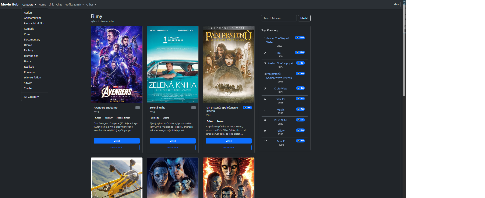
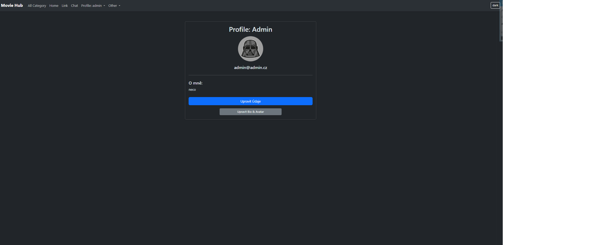
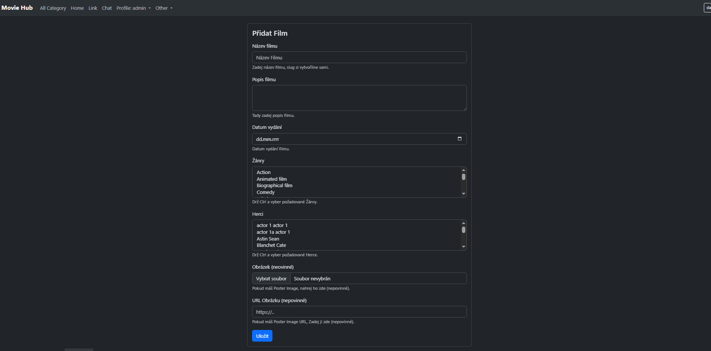
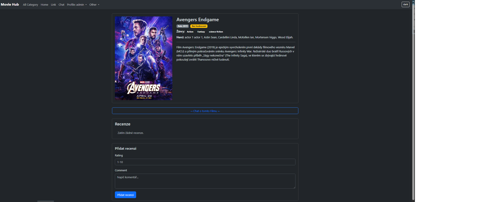

# Introduction 

# 🎬 MovieHub
Modern Django webová aplikace pro správu a hodnocení filmů.
Projekt běží v Docker prostředí s PostgreSQL a Redis.

## 📸 Screenshots
###### Homepage

##### Profile

##### Add movie (only with permission)

##### Movie detail

[//]: # (![Chat]&#40;docs/chat.png&#41;)
[//]: # (![Admin]&#40;docs/admin.png&#41;)

## Features
- Registrace a přihlášení uživatelů
- Přidávání filmů
- Hodnocení filmů (1–10)
- 1 uživatel = 1 recenze na film
- Reálný chat pomocí Django Channels + Redis
- Admin rozhraní

## Architecture
- Django (ASGI)
- Daphne server
- Redis (Channels layer)
- PostgreSQL
- Nginx reverse proxy
- Docker Compose orchestrace

## Environment

Development:
- DEBUG=1
- Django runserver / Daphne

Production:
- DEBUG=0
- Nginx reverse proxy
- Daphne
- Docker

 ## Environment

Development:
- DEBUG=1
- Django runserver / Daphne

Production:
- DEBUG=0
- Nginx reverse proxy
- Daphne
- Docker

# Technologie
    Python 3.13
    Django
    PostgreSQL 17
    Redis
    Django Channels
    Daphne
    Docker & Docker Compose
    Nginx (reverse proxy)

## Run with Docker
    docker compose up --build
##### Acces:
    http://localhost:8000

## Run Locally
    python manage.py runserver 8014

# Spuštění projektu (doporučeno – přes Docker)

### Requirements
###### Docker desktop
    docker --version
    docker compose version

###### Git/Git clone
    git clone https://github.com/JosefKaljanko/Django_Project_MovieHub.git
    cd Django_Project_MovieHub/moviehub

### Create .env (Docker); .env.local (Django runserver):
    DEBUG = 1
    SECRET_KEY=super-secret-key
    POSTGRES_DB=moviehub
    POSTGRES_USER=postgres
    POSTGRES_PASSWORD=postgres
    POSTGRES_HOST=db
    POSTGRES_PORT=5432
    REDIS_HOST=redis
    REDIS_PORT=6379

[//]: # (## Installation)

[//]: # (    pip install -r requirements.txt)

[//]: # ()
[//]: # (## Run)

[//]: # (    cd moviehub)

[//]: # (    python manage.py runserver)

## Docker container

##### Run
    • First Run
    docker compose up --build

    • After First Run
    docker compose up
          or
    docker compose up -d          # na pozadí

##### Stop
    • Stop project
    docker compose down

    • Stop and DELETE DB
    docker compose down -v

##### Restart
    • Restart
    docker compose restart web

### Database

    • Database
    docker compose exec web python manage.py migrate

    • create superuser
    docker compose exec web python manage.py createsuperuser

    • DB ze zálohy
    docker compose exec db pg_restore -U postgres -d moviehub_db2 --clean --if-exists /moviehub.dump
    docker compose exec -T db pg_restore -U postgres -d moviehub < moviehub.dump

### Open app
    http://localhost:8000
    http://localhost:8000/admin

### Vymazání cache:
    docker compose exec redis redis-cli FLUSHALL

### LOG:
    docker compose logs --tail=200 web
    docker compose logs -f

## Tests
    pytest -v

## Struktura projektu
    moviehub/
    │
    ├── accounts/
    ├── chat/
    ├── media/
    ├── moviehub/
    ├── movies/
    ├── pages/
    ├── reviews/
    │
    ├── docker-compose.yml
    ├── Dockerfile
    ├── requirements.txt
    ├── requirements_minimum.txt
    └── manage.py

### author
## Josef Kaljanko

[//]: # (## Run project with chat app)

[//]: # (PowerShell:)
[//]: # (cd moviehub)
[//]: # (daphne -b 127.0.0.1 -p 8015 moviehub.asgi:application)

## Environment variables

Example `.env` file is shown above.
Never commit real secrets to Git.

